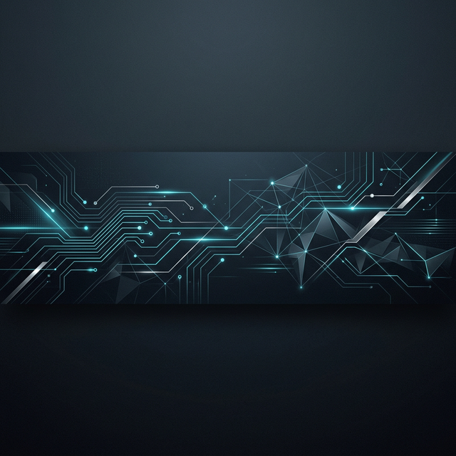

  

<h1 align="center">
  
</h1>

  
  
  

  

## Professional Summary

Architect and Full Stack Developer specializing in AI training protocols and production-grade software. I focus on bridging the gap between frontier AI models and scalable web infrastructure.

---

<table border="0">
  <tr>
    <td width="60%">
      <h3>Connect with me</h3>
      

        
        
      

      <h3>Languages and Tools</h3>
      

        
      

    </td>
    <td width="40%" align="center">
      
    </td>
  </tr>
</table>

---

### Strategic Focus
Currently engineering autonomous multi-agent systems and production-ready AI workflows designed for enterprise scalability.

### Technical Impact
Contributed to the training and evaluation of over 10,000 datasets for frontier AI models, focusing on alignment and performance optimization.

---

## Featured Implementations

<table>
<tr>
<td width="50%">

### Isaac Sim Physics

Advanced NVIDIA Isaac Sim simulation featuring breakable D6 joints and progressive gravitational modeling. 

`NVIDIA Isaac Sim` `PhysX` `USD` `Python`

</td>
<td width="50%">

### NeuroSim Engine

Behavioral simulation engine utilizing emotional intelligence trees and decision-making AI for complex character interactions.

`C#` `Behavior Trees` `Emotional AI` `Simulation`

</td>
</tr>
</table>

---

## Analytics

  
  

  

## Contribution Graph

  

---

  

