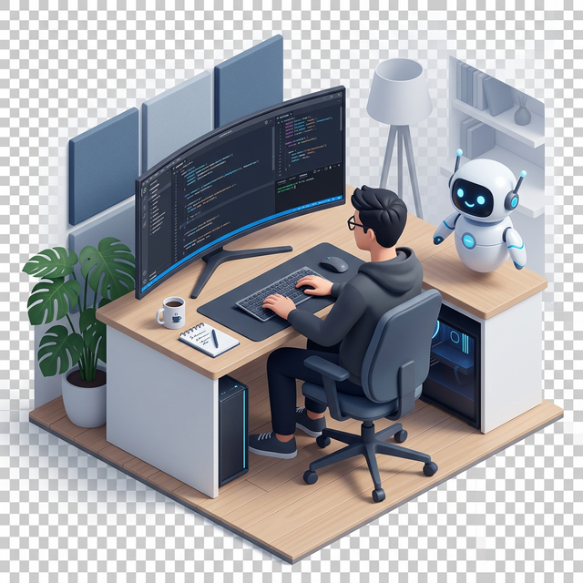

<h1 align="center">
  
</h1>

  
  
  

  

## Professional Summary

Architect and Full Stack Developer specializing in AI training protocols and production-grade software. Engineering autonomous multi-agent systems and enterprise AI workflows.

  

---

### Languages and Tools

  

---

### GitHub Trophies

  

---

## Technical Analytics

  
  

---

  

