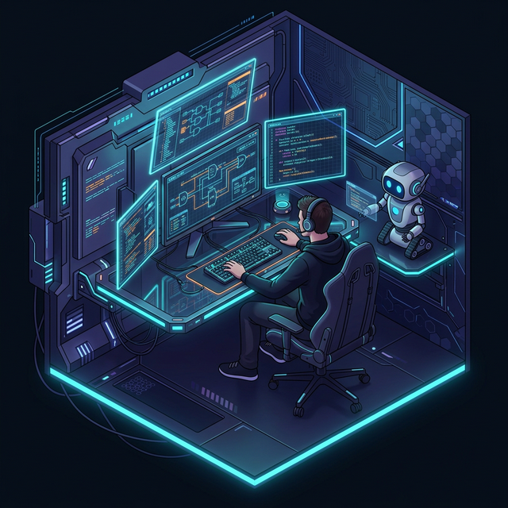

<h1 align="center">
  
</h1>

  

## Overview

Architect and Full Stack Engineer focused on the intersection of autonomous AI protocols and high-performance software systems. My work prioritizes structural logic and scalable intelligence.

---

### Intelligence & System Logic

```mermaid
graph LR
    A[Raw Data] --> B{AI Orchestrator}
    B --> C[Predictive Models]
    B --> D[Autonomous Agents]
    C --> E[Production Insight]
    D --> E
    style B fill:#1e1e2e,stroke:#6366F1,stroke-width:2px
```

---

<table border="0">
  <tr>
    <td width="55%">
      <h3>Technological Stack</h3>
      

        
      

      <h3>Status</h3>
      

        
      

    </td>
    <td width="45%" align="right">
      
    </td>
  </tr>
</table>

---

## Technical Analytics

  
  

---

  

