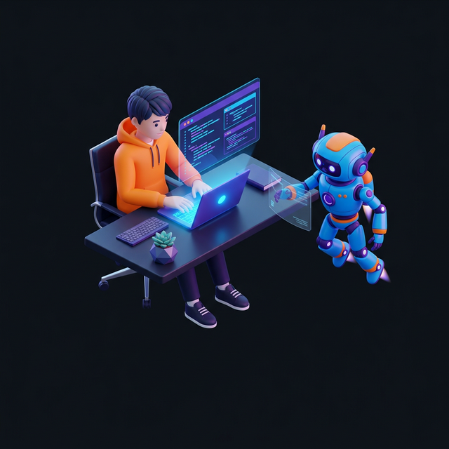

<h1 align="center">
  
</h1>

  

<table border="0">
  <tr>
    <td width="55%">
      

        <strong>System Architect & Full Stack Engineer</strong> 
        Engineering autonomous intelligence and modern web infrastructure.
      

      

      <h3 align="left">Technological Nexus</h3>
      

        
      

    </td>
    <td width="45%" align="right">
      
    </td>
  </tr>
</table>

---

  
  

---

  

